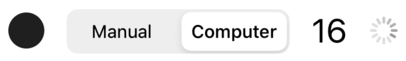
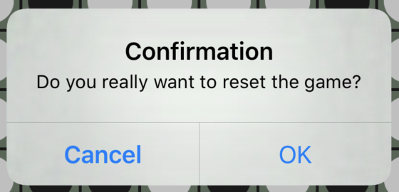
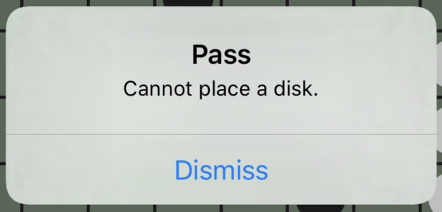
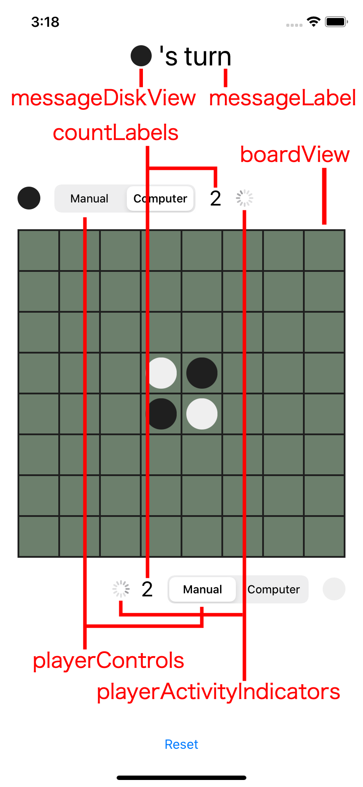

# リファクタリング・チャレンジ （リバーシ編） iOS版

本チャレンジは、 _Fat View Controller_ として実装された[リバーシ](https://en.wikipedia.org/wiki/Reversi)アプリをリファクタリングし、どれだけクリーンな設計とコードを実現できるかというコンペティションです（ジャッジが優劣を判定するわけではなく、設計の技を競い合うのが目的です）。


## はじめに

_Fat View Controller_ は iOS アプリ開発におけるアンチパターンとしてよく知られています。 _Fat View Contoller_ を作ると、 UI とロジックが分離されず、モジュール性が低く、テストしづらいコードができあがります。状態管理が複雑になり、修正時の影響範囲が見通しづらく、メンテナンス性が低下します。

試行錯誤の結果、自分なりに _Fat View Controller_ との戦い方を確立した人も多いでしょう。勉強会やカンファレンスなどで知見を共有することで、コミュニティとしての戦い方も進化してきました。また、このような問題は iOS アプリに限った話ではありません。アプリケーション開発においてよりクリーンな設計・コードを実現するために、様々なアーキテクチャパターンが考案されてきました。さらに、それらをサポートするフレームワークも多数開発されています。

しかし、そのような戦い方は抽象的な説明ではなかなか伝わりません。具体的な説明も、ボリュームの関係で極度に単純化された例になってしまいがちです。そのため、実際のプロジェクトに適用しようとしても、説明の意図通りに適用できているのかわからないというケースも多いのではないでしょうか。一方で、より現実的な例で説明しようとしても、業務で扱うような巨大で複雑なコードベースは、説明の題材には不適切です。戦い方を理解する前に、コードの挙動を理解するだけで多大な時間を必要とします。

もし、適切な複雑さとボリュームを持った題材があれば、 _Fat View Controller_ との戦い方をより具体的な形で学べるはずです。また、共通の題材を用いて比較すれば、どの方法が何をどのように解決するのか、また何をカバーしてい **ない** のかを可視化し、論じやすくなります。

そこで、誰もが仕様を知っており、かつ、適度な複雑さを持った対象として、[リバーシ](https://en.wikipedia.org/wiki/Reversi)（オセロとも呼ばれますが、オセロは[メガハウス社](https://www.megahouse.co.jp/)の登録商標のため、ここではリバーシと呼びます）を選びました。このコンペティションでは、用意された _Fat View Controller_ をどれだけクリーンにリファクタリングできるかを競います。

しかし、この _Fat View Controller_ のコードは、どうしようもないスパゲッティコードなわけではありません。 UI とロジックが分離されていないという問題がありますが、コード自体はそれなりに整理されています。下手に _Fat View Controller_ を解消しようとすると、不必要にコードを複雑化してしまうでしょう。そうならないように腕が問われます。是非、あなたの技を駆使して、理想の設計とコードを実現して下さい！

## なぜリバーシなのか

リバーシは、次の点で題材として優れていると考えています。

- 誰もがルールを知っているので仕様の理解が容易である
- ゲーム自体に最低限以上の複雑さがあり、記述すべき具体的なロジックが存在する（どのディスクを裏返すかなど）
- 明確にテストすべき事項（ゲームのルールを満たしているか）が存在する
- ボリュームが大きすぎない（熟練したエンジニアが数時間〜 1 日程度あれば扱える）

また、一般的なアプリ開発において問題となりやすい事項を扱えるように、本アプリの仕様として次のような特徴も備えています。

- 非同期処理を伴う（ディスクを裏返すアニメーション、 AI の思考など）
- 永続化のための I/O を伴う（ゲーム途中でプロセスが終了されても再開できるように）
- インタラクションと、それに伴う UI の制御が必要である

## チャレンジのしかた

本リポジトリを clone し、 Xcode で Reversi.xcodeproj を開いて下さい。本アプリは _Fat View Controller_ として実装されており、一部のビューコンポーネントや基本的なデータ型を除いて、すべてのコードが [ViewController.swift](Reversi/ViewController.swift) に書かれています。この `ViewController` クラスに書かれたコードをリファクタリングするのがチャレンジの内容です。

リファクタリングなので、 **アプリの挙動が変化しないようにして下さい** 。挙動を維持したまま、どれだけコードをクリーンにできるかというチャレンジです。なお、リファクタリングというタームは、ここでは挙動を変更せずにコードを変更するという意味で使っています。通常リファクタリングに求められるような段階的な修正を期待しているわけではありません。仕様を理解した上で理想的な設計を考え、ほぼスクラッチで再実装するような大胆な変更も問題ありません。もちろん、通常のリファクタリングと同じように、段階的に修正を行っても構いません。

なお、 ViewController.swift 以外のコード（リバーシの盤やディスクを表示するビューコンポーネントやディスクの裏表を表すデータ型）は変更を加えずにそのまま利用できるように作られています。たとえば、ディスクを裏返すアニメーションは `CellView` と、それを並べて保持する `BoardView` に実装されており、自分で実装する必要はありません。また、 Storyboard もそのまま利用することができます。ただし、それらの利用は強制されるわけではなく、また、修正が禁止されているわけではありません。たとえば、既存コードは UIKit ベースで実装されていますが、（挙動さえ維持できるなら） SwiftUI で再実装しても問題ありません。

## 修正のポイント

リバーシは明確なルールを持ったゲームです。ルールを正しく実装できているか単体テストで検証できることが望ましいです。現状では、ディスクを置いてディスクを裏返す処理とアニメーションの制御、ビューの更新（ディスクの枚数の表示）などが関連し合っており、リバーシのロジックだけを単体テストするのが困難です。リバーシのロジックを切り離して、単体テストできるようにしましょう。

さらに、リバーシというゲーム自体が持つロジックとは別に、アプリケーションに紐付いたロジックも存在します。たとえば、 "Manual" の（人間が操作する）プレイヤーは `BoardView` のセルをタップすることでディスクを配置しますが、ディスクを裏返すアニメーションの途中はセルがタップされても入力を無効化しなければなりません。そのような、 UI とより密接に関係しているロジックこそ複雑な状態管理が必要となりがちです。それらのロジックも UI のコードから分離して単体テストできると望ましいです。

UI だけでなく、ファイル I/O やデータベースへのアクセス、ネットワークを介した通信など、純粋なロジックではなく外部環境が関係する処理も単体テストがしづらい部分です。本チャレンジでは、ゲームの状態をセーブおよびロードする処理を扱います。そのような処理を実際の I/O から分離し、セーブ・ロードを伴う処理を単体テストできると良いでしょう。

また、現状ではゲームの状態（黒・白どちらの番か、勝敗はついたのか）や非同期処理の制御などの状態管理のコードが `ViewController` 中に散らばっています。それらを整理してコードの見通しを良くすることも良い修正につながるでしょう。

その他の方向性として、お気に入りのライブラリやフレームワークを使って、冗長なコードと戦うこともできます。たとえば、現状では非同期処理のコードは主にコールバック関数をベースにして書かれています。ライブラリを導入してコードをシンプルにすることもできます。

なお、本リポジトリの実装には、コーナーケースでのみ発生する既知のバグが存在します。テストを導入するなどしてバグを発見し、修正できると望ましいです。

上記のすべてを行わないといけないわけではありませんし、他に取り組むべき問題もあるでしょう。ここで挙げた内容は参考程度にとどめ、理想の設計によるクリーンなコードを実現して下さい。

## 詳細仕様

アプリが満たすべき仕様を説明します。シンプルなアプリなので、おおまかな仕様は実際に実行して操作してみることで把握可能です。ここでは、より細かい、注意すべき仕様について説明します。

### プレイヤーモード

本アプリには人間が操作する "Manual" と、 AI が操作する "Computer" の 2 種類のプレイヤーモードが存在します。

ユーザーは、黒・白ともいつでもプレイヤーモードを切り替えることができます。



"Manual" は盤のセルをタップすることでディスクを配置し、無効な手となるセルのタップ（ディスクを 1 枚も裏返せない、すでにディスクが置かれているなど）や、入力可能な状態でない（ "Computer" の思考中、ディスクが裏返されるアニメーションの途中など）場合、入力は無視されます。

"Computer" の思考は非同期的に行われ、その思考中もユーザーの入力はブロックされません。 "Computer" の思考中は、そのことを示すインジケータ（上図右端）を表示します。

#### 注意事項

"Computer" の思考中にプレイヤーモードが "Manual" に切り替えられた場合、 "Computer" の思考を停止し、インジケータを隠さなければなりません。

"Computer" の思考ロジック自体は本チャレンジの課題ではありません。本リポジトリの実装では、有効な手からランダムに一つを選択し、 2 秒後に結果を返します。独自のロジックを実装しても構いませんが、本チャレンジの評価対象には含まれません。

### ディスクのアニメーション

ディスクを置く・裏返す処理は非同期のアニメーションを伴い、一枚ずつ順番に処理されます。

アニメーションの途中でもユーザーの入力はブロックされません。

アニメーションの順番は次のように決められています。

- 最初に、新たなディスクを配置する
- 左上、上、右上、右、右下、下、左下、左の最大 8 列のディスクが裏返る可能性があるが、ここに列挙した順に、各列内のディスクを裏返す
- 各列内では、新たに配置されたディスクに近いディスクから順に裏返される

たとえば、 `x` が黒、 `o` が白のディスクを表し、 `-` がディスクの配置されていないセルを表すものとして、今、盤の状態が次の通りとします。

```
--------
x-------
-o------
--ooo---
---ox---
-----oox
---ooo--
--o-x---
```

このとき、下図の `#` の位置に黒（ `x` ）のディスクを置いたとします。

```
--------
x-------
-o------
--ooo---
---ox---
----#oox
---ooo--
--o-x---
```

すると、ディスクを置く・裏返すアニメーションは次の順番に実行されます。

```
--------
x-------
-4------
--3oo---
---2x---
----156x
---o7o--
--o-x---
```

その結果、最終的に盤の状態は次のようになります。

```
--------
x-------
-x------
--xoo---
---xx---
----xxxx
---oxo--
--o-x---
```

なお、あるセルのディスクを置いたり裏返したりするアニメーションは `BoardView` および `CellView` で実装されており、アニメーション自体を独自に実装する必要はありません。

### ディスクの枚数の表示

黒・白それぞれのディスクの枚数を画面上に表示します。


ディスクが置かれ、ディスクの枚数が更新される場合、すべてのディスクが裏返された後でまとめて枚数の表示を更新します。何枚のディスクが裏返されても、 1 手につき一度だけ枚数の表示が更新されます。

#### 注意事項

ディスクを 1 枚裏返す度に枚数の表示を更新してはいけません（実際にそのような仕様を試してみたところ、見づらかったため現仕様となりました）。盤の状態の変化を検知し、自動的に枚数の表示を更新するようなコードでは、この仕様をうまく扱えません。一連の処理をまとめて扱う必要があります。

### "Reset" ボタン

ユーザーは "Reset" ボタンを押すことで、いつでもゲームを初期化することができます。初期化の内容は次の通りです。

- 盤を初期状態に戻す
- 黒のターンにする
- 黒・白ともプレイヤーモードを "Manual" にする

なお、盤の初期状態は前述の表記を用いると次のとおりです。

```
--------
--------
--------
---ox---
---xo---
--------
--------
--------
```

誤操作によってゲームが初期化されてしまわないように、 "Reset" ボタンが押されると次のようなアラートを表示して、ユーザーの意思を確認します。 "Cancel" が選択された場合には、ゲームの初期化は行われません。



#### 注意事項

ディスクを裏返すアニメーションの途中や "Computer" の思考中も "Reset" ボタンは有効です。それらの非同期処理を停止してただちにゲームを初期化する必要があります。

"Reset" ボタンによってプレイヤーモードも初期化されるということは、プレイヤーモードはユーザー入力だけでなくプログラムからも変更され得るということです。

### メッセージエリア

今、黒のターンなのか、白のターンなのか、それともゲームの勝敗が着いた状態なのかをメッセージエリアに表示します。


黒または白のターンの場合はメッセージエリアに "●'s turn" と表示します。 "●" の部分には黒または白の円形が入ります。本リポジトリの実装では、"●" の部分の表示に `DiskView` （ `CellView` の内部で使用されている、黒または白の円形を表示するビューコンポーネント）が用いられています。

ゲームの勝敗が着いた場合は、メッセージエリアに "● won" と表示します。 "●" の取り扱いは "●'s turn" のときと同じです。ただし、引き分けの場合には "Tied" と表示します。

#### 注意事項

"Tied" のときは "●" が表示されず、 "Tied" が水平方向中央に表示されます。そのようなレイアウトは本リポジトリの実装をそのまま踏襲して構いません。 UI のレイアウトは本チャレンジの課題ではありません。

### パス

有効な手が存在しない場合、そのプレイヤーのターンはパスされます。

パスされる場合、次のようなアラートを表示します。



"Dismiss" ボタンが押されるとパスの処理が行われ、次のプレイヤーのターンに移ります。

パスするプレイヤーが "Computer" であっても、アラートの表示は必要です。その場合、 "Computer" の思考は行わずにただちにアラートが表示されます。

両プレイヤーとも有効な手が存在しない場合には、パスではなくゲーム終了となります。パスのアラートも表示しません。

アラートを表示し "Dismiss" ボタンが押されるまでの間は、メッセージエリアに "●'s turn" と、そのパスするプレイヤーのターンであることを表示しなければなりません。

#### 注意事項

パスの判定は UI を介在させずにロジックだけで完結できますが、アラートとメッセージエリアのターン表示が求められることで、パスの処理と UI のインタラクションを連携させなければなりません。単純にパスの処理をロジックで完結させてしまうと、それらの表示が省略されてしまいます。

### セーブ／ロード

ゲームの途中でアプリが強制終了されてしまっても同じ状況からゲームを再開できるように、自動的にゲームの状態が保存されます。アプリ開始時には、最後に保存されたゲームの状態が読み込まれます。

保存される項目は次の通りです。

- 黒・白どちらのターンか、または勝敗が着いているのか
- 黒・白それぞれのプレイヤーモードが "Manual" か "Computer" か
- 盤の状態（ 64 個のセルそれぞれに、ディスクが置かれていないか、または黒・白どちらのディスクが置かれているか）

保存は、 1 手ごと、またはプレイヤーモードが変更された場合に自動的に行われます。

#### 注意事項

本リポジトリの実装では、ディスクを裏返すアニメーションが完了してから保存が行われます。これは、 UI とロジックが分離されていないため、 UI の更新が行われないと状態の変更が完了しないからです。リファクタリングの結果として、アニメーションの完了を待たずに状態の変更を先取りして保存しても構いません。

## コード概要

本リポジトリの課題用コードについて説明します。

意味のあるコードが書かれているのは次の 5 ファイルです。

| ファイル | 提供する主な型 | 概要 |
|:--|:--|:--|
| [ViewController.swift](Reversi/ViewController.swift) | `ViewController` | アプリ本体（ `UIViewController` のサブクラス） |
| [BoardView.swift](Reversi/BoardView.swift)<br />（ Xcode 上では Views グループの中） | `BoardView` | リバーシの盤を表すビュー（ `UIView` のサブクラス） |
| [CellView.swift](Reversi/CellView.swift)<br />（ Xcode 上では Views グループの中） | `CellView` | リバーシの盤のセルを表すビュー（ `UIView` のサブクラス） |
| [DiskView.swift](Reversi/DiskView.swift)<br />（ Xcode 上では Views グループの中） | `DiskView` | リバーシのディスクを表すビュー（ `UIView` のサブクラス） |
| [Disk.swift](Reversi/Disk.swift)<br />（ Xcode 上では DataTypes グループの中） | `Disk` | リバーシのディスク（黒か白か）を表すデータ構造（ `enum` ） |

**基本的に ViewController.swift 以外には手を加える必要はありません** 。 `BoardView`, `CellView`, `DiskView` はリバーシ用に用意されたビュークラスで、 UIKit のコンポーネントと同じ感覚で利用できます。 `UISwitch` に不満があっても `UISwitch` そのものを改変するのではなく、ラッパークラスや `extension` で対応すると思います。 `BoardView` 等についても同様です。また、 `CellView` に関しては課題挑戦者が直接利用することもありません（ `BoardView` が内部的に利用しています）。 `DiskView` についても利用機会は限定的です。 `Disk` は黒か白かを表す小さな `enum` なので、実質的に使い方を覚える必要があるのは `BoardView` だけです。 `BoardView` にしても、 UIKit のビュークラス群と似た API を持つので、すぐに使い方を理解できると思います。

以下、一つずつ説明します（ CellView.swift は省略します）。ここで紹介する API についてはドキュメンテーションコメントが書かれているので、 Xcode 上で確認することもできます。

### Disk.swift

ディスクが黒（ dark ）か白（ light ）かを表す次のような `enum` が実装されています。

```swift
public enum Disk {
    case dark
    case light
}
```

`Disk` は補助的にいくつかの API を提供します。 `Disk` が提供する API は次の通りです。

| API | 概要 |
|:--|:--|
| `mutating func flip()` | 自身の値を、現在の値が `.dark` なら `.light` に、 `.light` なら `.dark` に反転させます。 |
| `var flipped: Disk { get }` | 自身の値を反転させた値（ `.dark` なら `.light` 、 `.light` なら `.dark` ）を返します。 |
| `static var sides: [Disk] { get }` | `[.dark, .light]` を返します。 |

### DiskView.swift

ディスクを表すビュー `DiskView` が実装されています。

```swift
class DiskView: UIView
```

`DiskView` は主に `CellView` で用いられ、直接 `DiskView` を使う機会は少ないですが、メッセージエリアとディスクの枚数の表示のために、ディスクを表示するために用いられています。


特に、メッセージエリアについては "●'s turn" か "○'s turn" かを切り替える必要があります。 `DiskView` が表示するディスクを色を変更するには `disk` プロパティを用います。

```swift
// 表示されるディスクの色を黒にする
diskView.disk = .dark

// 表示されるディスクの色を反転する
diskView.disk.flip()
```

`DiskView` が提供する API は次の通りです。

| API | 概要 |
|:--|:--|
| `var disk: Disk { get set }` | このビューが表示するディスクの色を決定します。 |
| `var name: String { get set }` | Interface Builder からディスクの色を設定するためのプロパティです。 `"dark"` か `"light"` の文字列を設定します。 |

### BoardView.swift

リバーシの盤を表すビュー `BoardView` が実装されています。また、 `BoardView` に対するインタラクションをハンドリングするための `BoardViewDelegate` が宣言されています。

```swift
class BoardView: UIView
protocol BoardViewDelegate: AnyObject
```

`BoardView` は 8 × 8 のセルを持ちます。 `BoardView` の API を通して、それらのセルの状態（黒、白、ディスクが置かれていない）を取得したり、変更したりすることができます。

```swift
// 3 列目・ 4 行目のセルの状態を取得
let disk: Disk? = boardView.diskAt(x: 3, y: 4)

// 3 列目・ 4 行目のセルを黒のディスクが置かれている状態に変更
boardView.setDisk(.dark, atX: 3, y: 4, animated: false)
```

列・行はそれぞれ `x`, `y` で表され、 0 番から始まることに注意して下さい。また、ディスクが置かれていない状態は　`nil` で表されます。

`setDisk()` メソッドの引数 `animated` に `true` を渡した場合、セルの状態を変更するアニメーションが実行されます。これは、 `UISwitch` の `setOn(_:animated:)` メソッド（参考: [API リファレンス](https://developer.apple.com/documentation/uikit/uiswitch/1623686-seton)）に類似しています。アニメーションは、変更前後のセルの状態によって 3 種類存在します。

| 前 | 後 | アニメーションの内容 |
|:--|:--|:--|
| `nil` | `.dark` または `.light` | ディスクが配置される。 |
| `.dark` または `.light` | `nil` | ディスクが取り除かれる。 |
| `.dark` または `.light` | 元と反転 | ディスクが裏返される。 |

どのアニメーションが適用されるかは自動的に決定されるため、この API の利用者がアニメーションの種類を選択する必要はありません。

`setDisk()` を利用すると、アニメーションの完了通知をコールバックで受け取ることもできます。

```swift
boardView.setDisk(.dark, atX: 3, y: 4, animated: true) { isFinished in
    // アニメーション完了時に呼ばれる
}
```

特に複数枚のディスクを順番に連続して裏返す場合などは、このコールバックを用いてタイミングを制御することが重要になります。

`setDisk()` によるアニメーションをキャンセルする API はありません。ただし、アニメーションの途中で、同一のセルに新しい状態が設定された場合には適切に処理されます。これも　`UISwitch` の `setOn(_:animated)` の挙動に似ています。

なお、 `BoardView` は **リバーシのルールに関する API を持ちません** 。たとえば、あるセルにディスクを配置したときに周囲のディスクを裏返したり、あるセルにある色のディスクを配置できるかを判定する API 等は提供しません。単なる、 8 × 8 のセルを持つテーブル上の構造を持ったビューにすぎません。

その他にも、 `BoardView` は補助的にいくつかの API を提供します。 `BoardView` が提供する API は次の通りです。

| API | 概要 |
|:--|:--|
| `weak var delegate: BoardViewDelegate?` | セルがタップされたときの挙動を移譲するためのオブジェクトです。 |
| `func diskAt(x: Int, y: Int) -> Disk?` | `x`, `y` で指定されたセルの状態を返します。セルにディスクが置かれていない場合は `nil` を返します。 |
| `let height: Int ` | 盤の高さ（ `8` ）を返します。 |
| `func reset()` | 盤をゲーム開始時に状態に戻します。このメソッドはアニメーションを伴いません。 |
| `func setDisk(_ disk: Disk?, atX x: Int, y: Int, animated: Bool, completion: ((Bool) -> Void)? = nil)` | `x`, `y` で指定されたセルの状態を与えられた `disk` に変更します。 `animated` が `true` の場合、アニメーションが実行されます。アニメーションの完了通知は `completion` で受け取ることができます。 `completion` が受け取る `Bool` 値は、 `UIView.animate()` （参考: [API リファレンス](https://developer.apple.com/documentation/uikit/uiview/1622515-animate)）等に準じます。 |
| `let width: Int` | 盤の幅（ `8` ）を返します。 |
| `let xRange: Range<Int>` | 盤のセルの `x` の範囲（ `0 ..< 8` ）を返します。 |
| `let yRange: Range<Int>` | 盤のセルの `y` の範囲（ `0 ..< 8` ）を返します。 |

`BoardView` は `BoardViewDelegate` を通じて、セルがタップされたことを通知します。

```swift
extension ViewController: BoardViewDelegate {
    func boardView(_ boardView: BoardView, didSelectCellAtX x: Int, y: Int) {
        // x 列目・ y 列目のセルがタップされたときに呼ばれる
    }
}
```

これは `UITableView` と `UITableViewDelegate` の関係に似ています。 `BoardView` の `delegate` プロパティを用いて `BoardViewDelegate` を設定します。典型的には、 View Controller を `BoardViewDelegate` に適合させ、 `delegate` プロパティに渡します。

```swift
class ViewController: UIViewController {
    override func viewDidLoad() {
        super.viewDidLoad()
        boardView.delegate = self
    }
}
```

`BoardViewDelegate` が宣言する API は次の通りです。

| API | 概要 |
|:--|:--|
| `func boardView(_ boardView: BoardView, didSelectCellAtX x: Int, y: Int)` | `boardView` の `x`, `y` で指定されるセルがタップされたときに呼ばれます。 |

### ViewController.swift

本課題の対象となる Fat View Controller `ViewController` が実装されています。

```swift
class ViewController: UIViewController
```

`ViewController` の実装は主に次の 8 個のパートに分かれています。

| パート | 内容　|
|:--|:--|
| 冒頭部 | `ViewController` のプロパティの宣言や `viewDidLoad()` ・ `viewDidAppear()` などの実装 |
| Reversi logics | マスにディスクがおけるかや、勝敗を判定するメソッドなどの実装 |
| Game management | 新規ゲームの開始やユーザーの入力待ち、勝敗判定など、リバーシのルール自体の実装 |
| Views | 状態変更をビューに反映するためのメソッドの実装 |
| Inputs | ユーザー入力をハンドリングするためのメソッドの実装 |
| Save and Load | ゲームの状態をファイルに保存・読み込みするためのメソッドの実装 |
| Additional types | このファイルで利用する補助的な型の実装 |
| File-private extensions | このファイルで利用する補助的な `extension` の実装 |

`ViewController` の実装で特筆すべきこととして、リバーシの盤の状態が `BoardView` インスタンスで管理されていることが挙げられます。 `boardView` プロパティがその役割を担っていて、モデルとビューのコードが混ざりあった状態です。さらに、ディスクが置かれたときに周辺のディスクをひっくり返す処理を実装した `placeDisk(_:atX:y:animated:completion:)` メソッド（と、その中から呼び出されている `animateSettingDisks(at:to:completion:)` メソッド）では、データの変更とアニメーションが互いに密接に関係した処理を行っています。これらは特に "Reversi logics" に関係が深いです。

全体の処理の流れは　"Game management" で管理されており、 `waitForPlayer()` メソッドによるプレイヤーの行動待ち（ "Manual" の場合はユーザーの入力待ち）と、その結果を受けて次の状態（次のプレイヤーの番か、パスか、勝敗が決して結果表示か）への遷移を扱う `nextTurn()` メソッドがその中心です。典型的には、

1. `waitForTurn()` でプレイヤーの行動待ち
2. プレイヤーの行動を受けて `placeDisk(_:atX:y:animated:completion:)` でディスクをひっくり返す
3. `nextTurn()` で次プレイヤーに遷移

を繰り返すことでゲームが進行します。最初は `viewDidAppear()` で `waitForTurn()` が呼ばれることでこのループに突入します。

他にわかりづらい点としては、 `animationCanceller` プロパティと `playerCancellers` プロパティがあります。本アプリには非同期処理のキャンセルが必要になるケースとして、ディスクをひっくり返すアニメーションの途中でのゲームリセットと、プレイヤーの行動待ち中のプレイヤーモードの切り替えがあります。前者ではアニメーションを中断しないといけません。後者では、たとえば、 "Computer" から "Manual" 切り替わったのに、 AI の思考が完了して勝手にディスクが置かれるというような事態を防がなければなりません。それらのキャンセル処理を管理するのが `animationCanceller` プロパティと `playerCancellers` プロパティです。対応する非同期処理中にはそれらのプロパティにキャンセラーが保持され、非同期処理が終わると `nil` がセットされます。

`@IBOutlet` で接続されたプロパティと、対応するビューの関係は次のようになっています。



## 結果一覧

チャレンジの結果一覧です。掲載を希望される方は、下記の表に行を追加する Pull Request をお送り下さい。

| リポジトリ | 作者 | アーキテクチャパターン | フレームワーク | UI | 備考 |
|:--|:--|:--|:--|:--|:--|
| [refactoring-challenge/reversi-ios](https://github.com/refactoring-challenge/reversi-ios) | [@koher](https://github.com/koher) | Fat View Controller | - | UIKit | 本リポジトリ |
| [koher/clean-reversi-ios](https://github.com/koher/clean-reversi-ios) | [@koher](https://github.com/koher) | Clean Architecture | - | UIKit | - |
| [koher/clean-reversi-macos](https://github.com/koher/clean-reversi-macos) | [@koher](https://github.com/koher) | Clean Architecture | - | AppKit | macOS アプリ版 |
| [koher/clean-reversi-swift](https://github.com/koher/clean-reversi-swift) | [@koher](https://github.com/koher) | Clean Architecture | - | - | 上記 2 アプリの共通部分となる Swift Package |
| [objective-audio/reversi-ios](https://github.com/objective-audio/reversi-ios) | [@objective-audio](https://github.com/objective-audio) | いきあたりばったり | - | UIKit | - |
| [Kuniwak/reversi-ios](https://github.com/Kuniwak/reversi-ios) | [@Kuniwak](https://github.com/Kuniwak) | Classical MVC | - | UIKit | 型つよモードでフルスクラッチ。テスト書いたら負けだと思っている → テストには勝てなかったよ |
| [hironytic/reversi-ios](https://github.com/hironytic/reversi-ios) | [@hironytic](https://github.com/hironytic) | MVVM + Redux | Combine | UIKit | ユニットテストとCIも追加しました |
| [marty-suzuki/reversi-ios](https://github.com/marty-suzuki/reversi-ios) | [@marty-suzuki](https://github.com/marty-suzuki) | Flux + MVVM | [RxSwift](https://github.com/ReactiveX/RxSwift) + [Unio](https://github.com/cats-oss/Unio) | UIKit | 切り出したロジックのユニットテストとViewControllerのユニットテストも実装しています |
| [kishikawakatsumi/reversi-ios](https://github.com/kishikawakatsumi/reversi-ios/tree/refactor2) | [@kishikawakatsumi](https://github.com/kishikawakatsumi) | Cocoa MVC | [Combine](https://developer.apple.com/documentation/combine) | UIKit | 小さな変更で受け入れられやすいリファクタリング |

## License

[MIT License](LICENSE)
