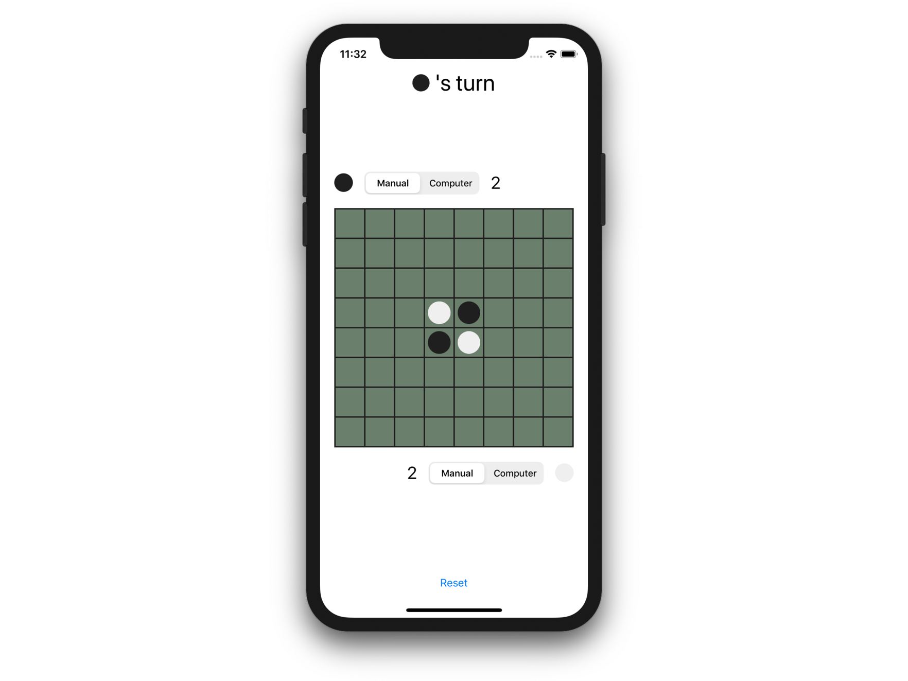

# Reversi Challenge iOS （仮）

Reversi Challenge iOS は、 _Fat View Controller_ として実装された[リバーシ](https://en.wikipedia.org/wiki/Reversi)アプリをリファクタリングし、どれだけクリーンな設計とコードを実現できるかというコンペティションです（ジャッジが優劣を判定するわけではなく、設計の技を競い合うのが目的です）。

## はじめに

_Fat View Controller_ は iOS アプリ開発におけるアンチパターンとしてよく知られています。 _Fat View Contoller_ を作ると、 UI とロジックが密結合してしまい、モジュール性が低く、テストしづらいコードができあがります。状態管理が複雑になり、修正時の影響範囲が見通しづらく、メンテナンス性が低下します。

しかし、 _Fat View Controller_ を解消するのは簡単なことではありません。たとえば、状態管理を _View Controller_ と分離し、単体テストできるようにしたいとします。複雑な状態変更を伴うコードはバグを生みやすく、単体テストで実装の正しさを検証したいところです。そのようなケースでは、ビューは単体テストで扱いづらいので、状態変更のロジックをビューのコードから分離することを考えます。しかし、ビューのアニメーションと状態の変更が交互に起こるような場合、ビューとロジックが関連し合っており、コードを分離するには工夫が必要です。また、 `UISwitch` や `UISegmentedControl` など、ビューコンポーネント自体が対象となる状態を保持していることもあります。そのようなケースで状態管理のコードをビューから切り離すということは、状態を二重に管理しなければならないということです。下手をすると、 _Fat View Controller_ を解消しようとした結果、冗長なコードを生み出すだけで余計にメンテナンス性を低下させてしまったということになりかねません。 _Fat View Controller_ と戦うには良い設計指針が必要です。

そのために、多くの開発者が知恵を絞ってきました。試行錯誤の結果、自分なりの戦い方を確立した人も多いでしょう。勉強会やカンファレンスなどで知見を共有することで、コミュニティとしての戦い方も進化してきました。また、このような問題は iOS アプリに限った話ではありません。アプリケーション開発においてよりクリーンな設計・コードを実現するために、様々なアーキテクチャパターンが考案されてきました。さらに、それらをサポートするフレームワークも多数開発されてきました。

しかし、そのような戦い方を共有しようとする際には、抽象的な説明に終始するか、極度に単純化された具体例が用いられることが多いです。そのため、実際のアプリケーション開発でどのように適用すべきなのかイメージしづらいことが多いのではないでしょうか。一方で、業務で扱うような巨大で複雑なコードベースは、その挙動を理解するだけでも多大な時間を必要とし、説明の題材には不適切です。

もし、適切な複雑さとボリュームを持った題材があれば、 _Fat View Controller_ との戦い方をより具体的な形で学べるはずです。また、共通の題材を用いて比較すれば、どの方法が何をどのように解決するのか、また何をカバーしてい **ない** のかを可視化し、論じやすくなります。

そこで、誰もが仕様を知っており、かつ、適度の複雑さを持った対象として、[リバーシ](https://en.wikipedia.org/wiki/Reversi)（オセロとも呼ばれますが、オセロは[メガハウス社](https://www.megahouse.co.jp/)の登録商標のため、ここではリバーシと呼びます）を題材に選びました。用意された _Fat View Controller_ のコードはどうしようもないスパゲッティコードなわけではなく、それなりに整理されています。 UI とロジックが密結合していてテストしづらいという問題がありますが、下手に _Fat View Controller_ を解消しようとすると、不必要にコードを複雑化してしまうでしょう。是非、あなたの技を駆使して _Fat View Controller_ と戦ってみて下さい！

## なぜリバーシなのか

リバーシは、次の点で題材として優れていると考えています。

- 誰もがルールを知っているので仕様の理解が容易である
- ゲーム自体に最低限以上の複雑さがあり、記述すべき具体的なロジックが存在する（どのディスクがひっくり返るかなど）
- 明確にテストすべき事項（ゲームのルールを満たしているか）が存在する
- 非同期処理を伴う（アニメーション、 AI の思考中など）
- インタラクションと、それに伴う UI の制御が必要である
- 永続化のための I/O を伴う（ゲーム途中でプロセスを終了しても再開できるように）
- ボリュームが大きすぎない（熟練したエンジニアが数時間〜 1 日程度あれば扱える）

## チャレンジのしかた

本リポジトリを clone し、 Xcode で ReversiChallenge.xcodeproj を開いて下さい。本アプリは _Fat View Controller_ として実装されており、一部のビューコンポーネントや基本的なデータ型を除いて、すべてのコードが [ViewController.swift](ReversiChallenge/ViewController.swift) に書かれています。この `ViewController` クラスに書かれたコードをリファクタリングするのがチャレンジの内容です。

リファクタリングなので、 **アプリの挙動が変化しないようにして下さい** 。挙動を維持したまま、どれだけコードをクリーンにできるかというチャレンジです。なお、リファクタリングというタームは、ここでは挙動を変更せずにコードを変更するという意味で使っています。通常リファクタリングに求められるような段階的な修正を期待しているわけではありません。仕様を理解した上で理想的な設計を考え、ほぼスクラッチで再実装するような大胆な変更も問題ありません。もちろん、通常のリファクタリングと同じように、段階的に修正を行っても構いません。

なお、 ViewController.swift 以外のコード（リバーシの盤やディスクを表示するビューコンポーネントやディスクの裏表を表すデータ型）は変更を加えずにそのまま利用できるように作られています。たとえば、ディスクを裏返すアニメーションは `CellView` と、それを並べて保持する `BoardView` に実装されており、自分で実装する必要はありません。また、 Storyboard もそのまま利用することができます。ただし、それらの利用は強制されるわけではなく、また、修正が禁止されているわけではありません。たとえば、既存コードは UIKit ベースで実装されていますが、（挙動さえ維持できるなら） SwiftUI で再実装しても問題ありません。

## 修正のポイント

リバーシは明確なルールを持ったゲームです。ルールを正しく実装できているか単体テストで検証できることが望ましいです。現状では、ディスクを置いてディスクを裏返す処理とアニメーションの制御、ビューの更新（ディスクの枚数の表示）などが密結合しており、リバーシのロジックだけを単体テストするのが困難です。リバーシのロジックを切り離して、単体テストできるようにしましょう。

さらに、リバーシというゲーム自体が持つロジックとは別に、アプリケーションに紐付いたロジックも存在します。たとえば、 "Manual" の（人間が操作する）プレイヤーは `BoardView` のセルをタップすることでディスクを配置しますが、ディスクを裏返すアニメーションの途中はセルがタップされても入力を無効化しなければなりません。そのような、 UI とより密接に関係しているロジックこそ複雑な状態管理が必要となりがちです。それらのロジックも UI のコードから分離してテストできると望ましいです。

また、現状ではゲームの状態（黒・白どちらの番か、勝敗はついたのか）や非同期処理の制御などの状態管理のコードが `ViewController` 中に散らばっています。それらを整理してコードの見通しを良くすることも良い修正につながるでしょう。

その他の方向性として、お気に入りのライブラリやフレームワークを使って、冗長なコードと戦うこともできます。たとえば、現状では非同期処理のコードは主にコールバック関数をベースにして書かれています。ライブラリを導入してコードをシンプルにすることもできます。

上記のすべてを行わないといけないわけではありませんし、ここに書かれている他にも様々な問題があるでしょう。ここで挙げた内容は参考程度にとどめ、理想の設計によるクリーンなコードを実現して下さい。

## 詳細仕様

アプリが満たすべき仕様を説明します。シンプルなアプリなので、おおまかな仕様は実際に実行して操作してみることで把握可能です。ここでは、より細かい、注意すべき仕様について説明します。

(TODO)

## 結果一覧

チャレンジの結果一覧です。掲載を希望される方は、下記の表に行を追加する Pull Request をお送り下さい。

| リポジトリ | 作者 | アーキテクチャパターン | フレームワーク | UI | 備考 |
|:--|:--|:--|:--|:--|:--|
| [koher/reversi-challenge-ios](https://github.com/koher/reversi-challenge-ios) | [@koher](https://github.com/koher) | Fat View Controller | - | UIKit | 本リポジトリ |

## License

[MIT License](LICENSE)